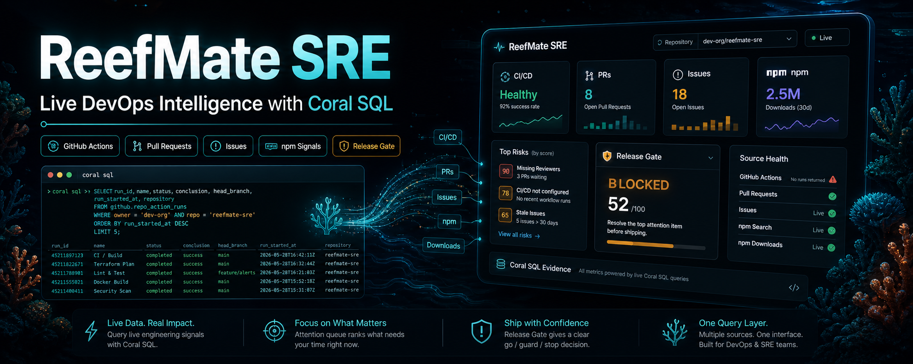
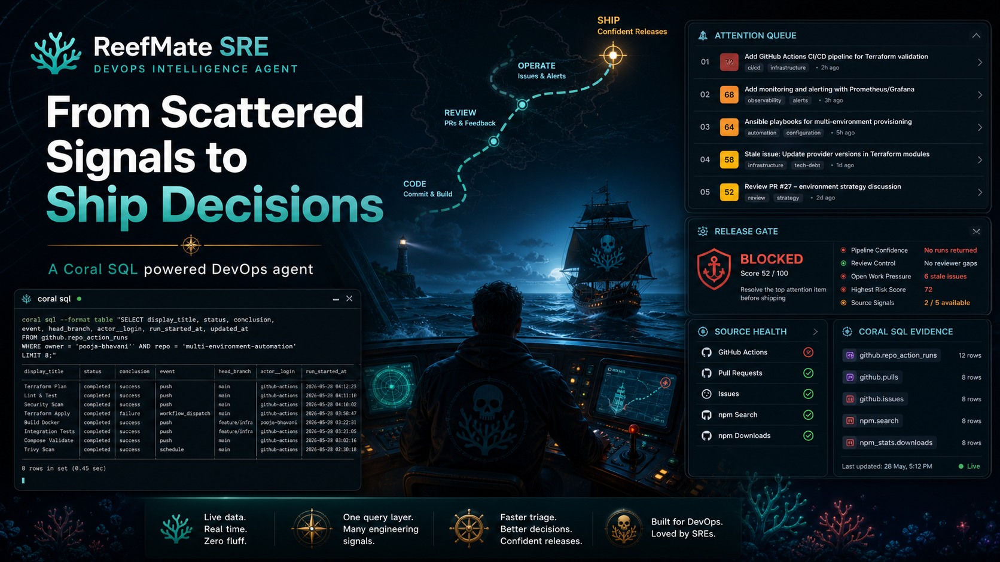
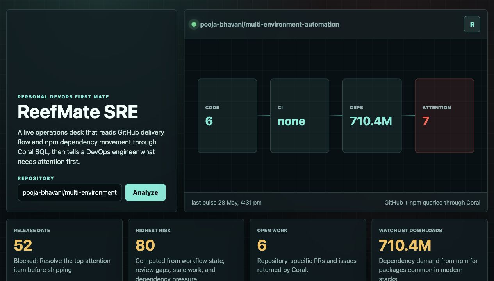
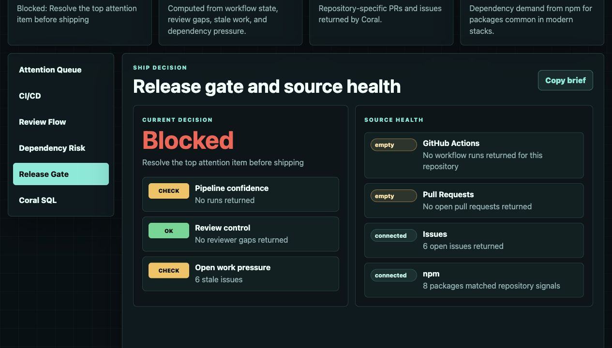
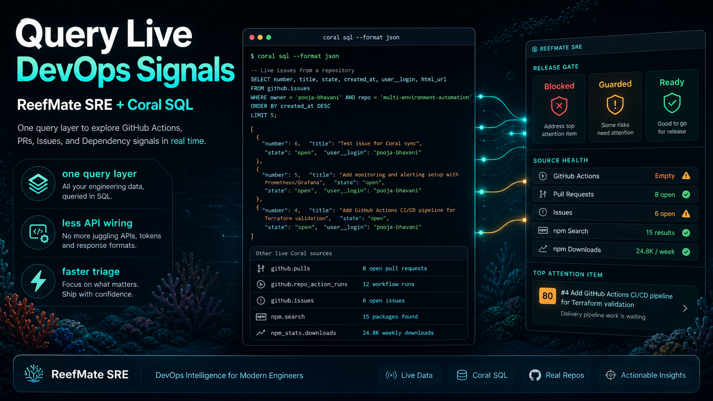
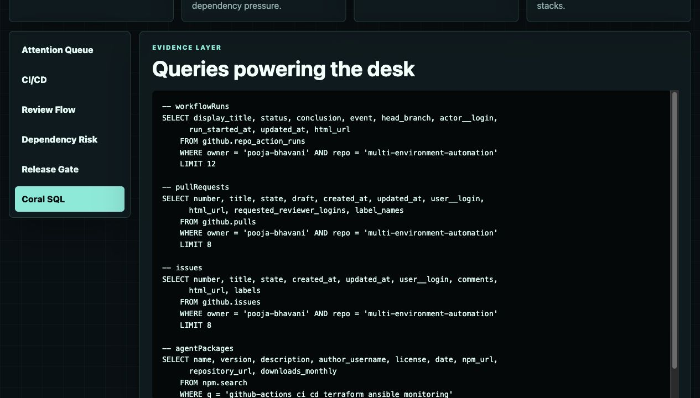

# ReefMate SRE

ReefMate SRE is a personal DevOps first mate. It reads live GitHub delivery signals and npm dependency movement through Coral SQL, then ranks what needs a DevOps engineer's attention first.

It is intentionally built around live Coral queries. There are no fixture rows or canned repository results: changing the repository input changes the GitHub workflow, PR, issue, npm search, package download, release-gate, and source-health output.



### Product Cover




### Attention Queue



### Release Gate



### Coral SQL Cover



### Coral SQL Evidence



## What It Does

- Finds risky GitHub workflow runs.
- Highlights PRs that need review flow decisions.
- Surfaces active issues that need triage.
- Computes a release gate from pipeline, review, stale-work, and risk signals.
- Shows source health so empty GitHub Actions or PR data is clear instead of misleading.
- Derives npm search terms and package watchlists from the repository's live issues, PRs, labels, and workflow names.
- Shows the Coral SQL behind every panel.

## Coral Usage Map

| App surface | Coral source | Why it matters for DevOps |
| --- | --- | --- |
| Attention Queue | `github.repo_action_runs`, `github.pulls`, `github.issues`, `npm_stats.downloads` | Ranks failed pipelines, stuck reviews, open operational work, and dependency pressure in one queue. |
| CI/CD | `github.repo_action_runs` | Shows recent workflow state, failed runs, running jobs, triggering event, branch, actor, and evidence link. |
| Review Flow | `github.pulls`, `github.issues` | Finds PRs without reviewers, draft work needing an owner decision, and issues waiting for triage. |
| Dependency Risk | `npm.search`, `npm_stats.downloads` | Searches npm using repository-derived signals, then checks current package download movement. |
| Release Gate | `github.repo_action_runs`, `github.pulls`, `github.issues` | Computes a practical ship/no-ship signal from pipeline confidence, review control, and stale work. |
| Coral SQL | All sources above | Displays the exact SQL used so every UI decision is auditable. |

## Live Data Contract

- The browser calls `/api/dashboard?owner=<owner>&repo=<repo>`.
- The Node server runs Coral SQL at request time with the selected repository.
- Full GitHub URLs and `owner/repo` inputs are both normalized safely.
- Empty live sources are shown as source health signals instead of being replaced with fake data.
- npm searches and watched packages are derived from repository labels, issue titles, PR titles, workflow names, and repo name keywords.

## Run Locally

Install npm
```
npm install
```

Make sure Coral can access the required sources:

```bash
npm run test:coral
```

Start the app:

```bash
npm run dev
```

Open:

```text
http://localhost:4173
```

By default the app opens with `withcoral/coral`, a public repository with active PRs and workflow runs. You can enter any `owner/repo` or full GitHub repository URL in the app UI and click `Analyze`.

You can also set a default repository from the terminal:

```bash
REPO_OWNER=your-org REPO_NAME=your-repo npm run dev
```

## Quick Review Path

1. Run `npm run test:coral` to verify the required Coral sources.
2. Run `npm run dev` and open `http://localhost:4173`.
3. Paste a repository such as `pooja-bhavani/multi-environment-automation`.
4. Check the Attention Queue, Release Gate, Source Health, and Coral SQL views.
5. Use `Copy brief` in Release Gate to copy the live decision summary.

## Repository Checklist

- Star the Coral GitHub repository from the submitting GitHub account.
- Join the Coral Discord with the submitting identity.
- Keep the project repository public or shareable for review.
- Include the local run commands above in the submission notes.
- Mention that the app uses five live Coral-backed source surfaces: GitHub Actions, PRs, issues, npm search, and npm package downloads.

## Coral SQL Commands

Recent GitHub Actions workflow runs:

```bash
coral sql --format json "SELECT display_title, status, conclusion, event, head_branch, actor__login, run_started_at, updated_at, html_url FROM github.repo_action_runs WHERE owner = 'withcoral' AND repo = 'coral' LIMIT 12"
```

Open pull requests:

```bash
coral sql --format json "SELECT number, title, state, draft, created_at, updated_at, user__login, html_url, requested_reviewer_logins, label_names FROM github.pulls WHERE owner = 'withcoral' AND repo = 'coral' LIMIT 8"
```

Open issues:

```bash
coral sql --format json "SELECT number, title, state, created_at, updated_at, user__login, comments, html_url, labels FROM github.issues WHERE owner = 'withcoral' AND repo = 'coral' LIMIT 8"
```

Repository-aware package discovery:

```bash
coral sql --format json "SELECT name, version, description, author_username, license, date, npm_url, repository_url, downloads_monthly FROM npm.search WHERE q = 'github-actions ci cd terraform ansible monitoring' ORDER BY downloads_monthly DESC LIMIT 8"
```

Package download telemetry:

```bash
coral sql --format json "SELECT package_name, downloads, start, \"end\" AS end_date FROM npm_stats.downloads WHERE package_name = '@actions/core' LIMIT 1"
```
